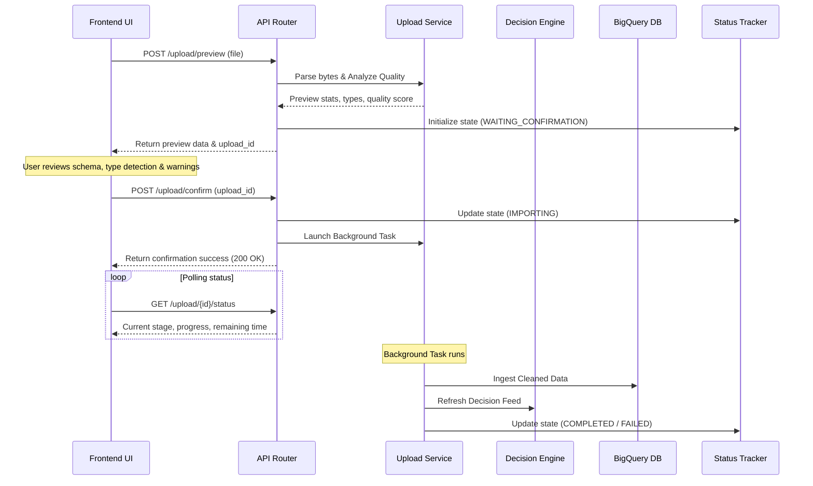

# StreamLine - Autonomous Decision Intelligence Platform

StreamLine is a production-ready AI SaaS platform designed to offer businesses autonomous decision intelligence capabilities. The repository integrates a Next.js frontend alongside a Clean Architecture FastAPI backend.

## Tech Stack
* **Frontend**: Next.js, React, Tailwind CSS, TypeScript
* **Backend**: Python 3.12, FastAPI, Pydantic v2, Google Cloud Storage, BigQuery, Gemini API, RAPIDS cuDF, cuML, Firebase Authentication (ready)
* **DevOps**: Docker, Docker Compose, Makefile

---

## Backend Directory Structure
The backend codebase resides side-by-side with the frontend within the root and the `app/` folder, organized under clear architectural bounds:

```
app/
├── main.py                 # FastAPI Application entry point and router registration
├── api/                    # API Routers (organized by version v1)
│   └── v1/                 # Endpoints injecting service layers
├── core/                   # Infrastructure configuration, structured logging, middleware, security
├── database/               # Database client adapters (BigQuery, Google Cloud Storage)
├── models/                 # Domain objects and core business entities
├── schemas/                # Pydantic v2 request & response validation schemas
├── services/               # Application service layers executing domain logic
└── repositories/           # Data access repository layers following the Repository Pattern
```

---

## Setup & Running the Backend

### Prerequisites
1. Python 3.12+
2. Docker & Docker Compose (optional)

### Local Development
1. Create a virtual environment and activate it:
   ```bash
   python -m venv .venv
   # Windows:
   .venv\Scripts\activate
   # Linux/macOS:
   source .venv/bin/activate
   ```
2. Install Python dependencies:
   ```bash
   make install
   ```
3. Copy environment variables file and configure it:
   ```bash
   cp .env.example .env
   ```
4. Run the FastAPI development server:
   ```bash
   make run
   ```
   The interactive API documentation will be available at `http://localhost:8000/docs`.

### Running with Docker Compose
To run the application inside a Docker container:
```bash
make docker-up
```
To tear down the containers:
```bash
make docker-down
```

### Formatting, Linting, & Testing
We use `ruff`, `black`, and `mypy` to maintain high code quality:
* **Format code**: `make format`
* **Lint code**: `make lint`
* **Run tests**: `make test`

---

## Architectural Flow



---

## Architectural Principles
1. **SOLID Principles**: Each module and class has a single responsibility. We use interface definitions and abstract classes for decoupling code.
2. **Repository Pattern**: Data persistence details (BigQuery, GCS, etc.) are abstracted away behind repository interfaces, making it trivial to swap storage engines.
3. **Service Pattern**: Business logic is encapsulated in isolated services which are injected into API handlers.
4. **Dependency Injection**: FastAPI's native dependency injection (`Depends`) is used to resolve and mock repositories and services during runtime and testing.

---

## Google Cloud Storage (GCS) Configuration
The platform integrates with GCS for persisting uploaded datasets:
* **Local Development**: Specify `GOOGLE_APPLICATION_CREDENTIALS` path pointing to your GCS service account JSON key file in the `.env` file. Ensure the service account possesses `Storage Object Admin` permission.
* **Cloud Run Deployment**: Omit `GOOGLE_APPLICATION_CREDENTIALS`. The application will authenticate seamlessly via Application Default Credentials (ADC) using the service account assigned to the Cloud Run service.
* **Bucket Settings**: Change `GCS_BUCKET_NAME` to specify your target storage bucket name.

---

## Data Cleaning & Preprocessing Configuration
The ingestion pipeline automatically standardizes and cleans business datasets before they are stored in Google BigQuery:
* **Snake Case Headers**: Automatically converts headers into lowercase, removes special characters, and formats them in `snake_case`.
* **Missing Value Imputations**: Resolves missing numeric values with the column Median, categorical/text fields with the Mode, datetimes with a Forward Fill, and booleans with `False`.
* **Value Normalization**: Converts currency strings (e.g., `$1,200.50`) and percentage expressions (e.g., `12.5%`) to standard float and decimal formats.
* **Data Quality Score**: Renders a quality index (0–100) based on cell completion ratios, row duplicates, and structural anomalies.

---

## Next.js Frontend Setup

### Prerequisites
1. Node.js 18+
2. pnpm or npm

### Local Development
1. Install node dependencies:
   ```bash
   npm install
   ```
2. Configure frontend variables in `.env`:
   ```env
   NEXT_PUBLIC_API_URL="http://localhost:8000"
   ```
3. Run the development server:
   ```bash
   npm run dev
   ```
   Open `http://localhost:3000` to interact with the platform.

---

## Production Deployment Guide

### Frontend Deployment: Vercel
1. Commit and push all changes to your GitHub repository.
2. Link the repository to your Vercel Account.
3. Configure the **Build Settings** to use Next.js default settings.
4. Set the **Environment Variables**:
   * `NEXT_PUBLIC_API_URL`: Point to your live Google Cloud Run backend URL (e.g., `https://streamline-backend-xxxxx.run.app`).
5. Click **Deploy**.

### Backend Deployment: Google Cloud Run
1. Build the production Docker image:
   ```bash
   gcloud builds submit --tag gcr.io/your-project-id/streamline-backend
   ```
2. Deploy the container to Cloud Run:
   ```bash
   gcloud run deploy streamline-backend \
     --image gcr.io/your-project-id/streamline-backend \
     --platform managed \
     --region us-central1 \
     --allow-unauthenticated \
     --set-env-vars="ENVIRONMENT=production,GOOGLE_CLOUD_PROJECT=your-project-id,GCS_BUCKET_NAME=your-bucket-name,BIGQUERY_DATASET=your-dataset-name,GEMINI_API_KEY=your-gemini-key"
   ```
3. Copy the service URL returned by Cloud Run and configure it in your Vercel Environment Variables.


